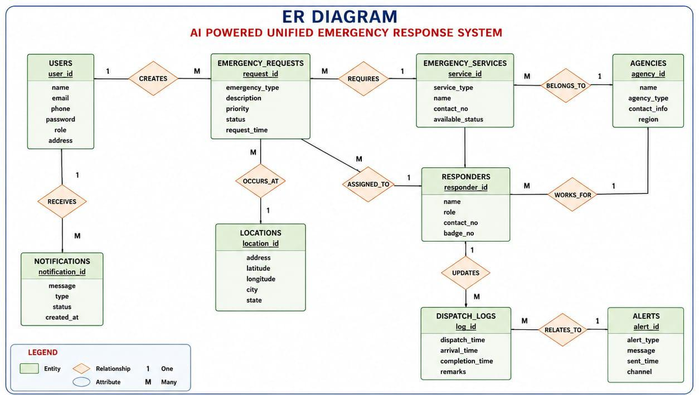
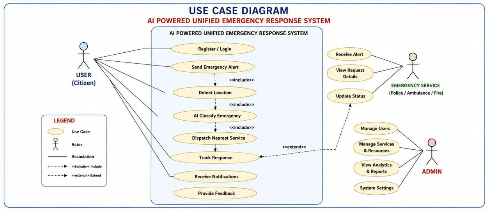

🤖 AI Powered Unified Emergency Response System

📌 1. Project Title

AI Powered Unified Emergency Response System

🧩 2. Problem Statement

Emergency response systems today operate in silos, where services such as police, ambulance, and fire departments function independently with limited coordination. During critical situations, delays occur due to inefficient communication, lack of real-time data, and manual decision-making processes.

In many regions, especially rural and semi-urban areas, emergency response is further hindered by the absence of intelligent systems that can analyze situations, prioritize requests, and dispatch the nearest available resources.

❗ Key Issues:

Increased response time

Misallocation of emergency resources

Lack of real-time situational awareness

Preventable loss of life and property

👉 Therefore, there is a need for a unified, AI-driven emergency response system.

🎯 3. Project Objectives

🔹 Primary Objectives

Develop a centralized platform integrating police, ambulance, and fire services

Implement AI-based emergency classification and prioritization

Enable real-time tracking and smart dispatch

Reduce response time using automation

Provide seamless communication between stakeholders

🔹 Secondary Objectives

Improve operational efficiency

Enhance public safety and trust

Generate data-driven insights

Enable scalability for smart cities

⚙️ 4. System Features

🚨 AI-based emergency detection and classification

📍 Real-time GPS tracking

🧠 Smart dispatch system (nearest unit allocation)

📡 Integrated communication platform

📊 Analytics dashboard

🔔 Instant alerts and notifications

📱 Mobile and web interface

🛠️ 5. Technology Stack

Category	       Technology

Frontend	       React.js / Flutter
Backend	         Python (FastAPI / Django)
Database	       PostgreSQL / MongoDB
AI Engine	       Machine Learning Models
APIs	           Google Maps API
Notifications	   Firebase Cloud Messaging
Authentication	 JWT / OAuth

🧱 6. System Modules

🔹 Module 1: User Authentication

Secure login & registration

Role-based access (User, Admin, Responder)

JWT authentication

🔹 Module 2: Emergency Request Handling

One-click emergency alert

Input emergency type & severity

Automatic location detection

🔹 Module 3: AI Decision Engine

Classifies emergency (fire, medical, crime)

Assigns priority level

Predicts required resources

🔹 Module 4: Smart Dispatch System

Finds nearest available service

Sends dispatch notifications

Route optimization

🔹 Module 5: Real-Time Tracking

Live tracking of emergency units

Status updates

User notifications

🔹 Module 6: Communication Module

User ↔ responder communication

Inter-department communication

🔹 Module 7: Admin Dashboard

Monitor all emergencies

Analyze performance

Generate reports

🔄 7. System Workflow

1. User sends emergency request via app

2. System captures GPS location

3. Request is sent to backend server

4. AI engine classifies emergency type

5. Priority level is assigned

6. Nearest emergency service is identified

7. Dispatch request is sent

8. Emergency unit is tracked in real-time

9. Notifications are sent to stakeholders

10. Status updates until completion

11. Data stored for analytics

🗄️ 8. Database Design

S.No	Table Name	       Description

1	    Users	              Stores user & responder details
2	    Emergency_Requests	Stores emergency request data
3	    Locations	          Stores GPS coordinates
4	    Emergency_Services	Police, fire, ambulance units
5	    Dispatch_Logs	      Tracks dispatch activities
6	    AI_Results	        AI predictions & classifications
7	    Notifications	      Alerts and updates
8	    Admin_Logs	        System activity logs

📊 9. System Diagrams

🔹 ER Diagram

🔹 Use Case Diagram

📈 10. Expected Outcomes

Reduced emergency response time

Better coordination between services

Efficient resource utilization

Improved public safety

Data-driven decision making

🚀 11. Implementation Strategy

Phase 1: Requirement Analysis

Phase 2: Backend & AI Development

Phase 3: Frontend Integration

Phase 4: Testing

Phase 5: Deployment

🔮 12. Future Enhancements

IoT integration (smart sensors, wearables)

Voice-based emergency activation

Predictive disaster analytics

Smart city integration

Multi-language support  

     
## 🗄️ Diagrams

### ER Diagram

### Use Case Diagram

👤 Author

Yasodha Sivakumar
